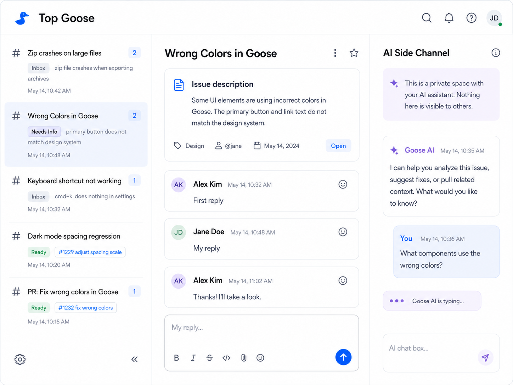

# Top Goose

Top Goose is a desktop app for working with GitHub issues and pull requests as conversations, with a private Goose side-channel attached to each one.

The core UI looks more like Slack than GitHub:

- Left: issues or pull requests as channels
- Center: the GitHub discussion
- Top: issue or pull request metadata
- Right: a private Goose conversation scoped to the current GitHub conversation

GitHub remains the source of truth for the public conversation. Goose maintains a separate private conversation that is continuously given enough GitHub context to understand what is happening.

Issues and pull requests share the channel list and persistent Goose pane, but they keep separate center views and filters. A PR view includes its description, general comments, submitted review summaries, and inline review threads. Top Goose does not try to become a full code review client: Goose already has the repository context and can use `gh` for most actions. Approve is the one direct PR action because it is common and unambiguous.

Opening a PR never checks out or runs contributor code. The persistent Goose session starts in the configured clone or a neutral `pr-N` worktree; Goose checks out PR code only when the user asks.

## Goals

- Make GitHub issues feel like chat channels
- Provide a fast inbox for conversations that need attention
- Make replying to GitHub discussions pleasant
- Attach a persistent Goose conversation to each issue and pull request
- Keep the public GitHub conversation and private Goose conversation distinct
- Keep GitHub API cost proportional to actual activity rather than to elapsed time
- Keep the first implementation small

## Initial Scope

The first version targets:

- Electron
- React / TypeScript
- GitHub REST API for change detection and writes
- GitHub GraphQL API for batched sidebar hydration and Projects V2 fields
- GitHub Notifications API
- Goose via ACP(+) v1
- One Goose session per GitHub issue or pull request

Supporting arbitrary ACP agents is explicitly not required initially.

## UI

Reference mockup:



The mockup is illustrative rather than exact and labels the right pane "AI Side Channel" rather than naming Goose.

### Left Pane

A Slack-like list of GitHub conversations, sorted by most recent update rather than grouped by workflow state. A centered segmented control switches between issues and pull requests.

Sources can include:

- GitHub notifications
- Assigned issues
- Issues where the user participated
- Mentions
- Unread activity

Issue and pull request notifications update their matching lists.

Each row shows the issue title, unread count where relevant, and a compact second line with its workflow state and useful context from the latest activity.

For example:

```text
Zip crashes on large files (2)
[Inbox] zip file crashes when exporting archives
```

Workflow states such as `Inbox`, `Needs Information`, `Triaged`, and `Ready` are the `Status` field of the issue's Projects V2 board item, not issue labels and not separate sections in the sidebar.

The sidebar can filter to one workflow state at a time. This filter combines with the unread, unreplied, and assigned filters.

Pull requests have separate filters for review requested, assigned, authored, older than seven days, draft/ready state, and review decision.

Search uses GitHub's issue and pull request search, scoped to the configured repository. Results can include closed conversations and anything else outside the open-item index. Selecting a result switches to the matching issue or pull request view and opens the normal detail and persistent Goose panes without adding the result to the regular sidebar list.

This matters for the API design: Projects V2 fields exist only in GraphQL. There is no REST equivalent. Any view that shows workflow state, including the sidebar, requires a GraphQL read.

The board also carries a snooze date as a Projects V2 date field. A snoozed issue is de-emphasized in the sidebar until its snooze date passes.

`Ready` means the issue is ready for implementation. Its second line shows the latest activity like any other row.

Unread state should correspond as closely as practical to GitHub notification state.

### Unread Counts

GitHub tracks unread per notification thread, not as a number of unread comments, so a count has to be derived. Fetching comments per row to count them would defeat the point of batched hydration.

Instead, hydration selects `comments { totalCount }`, a single cheap field, and the app records the count at the moment a thread was marked read. Unread is the difference between the two.

This is approximate. Deleted comments make it undercount, and edits do not register at all. Both are rare and neither is noticeable in a sidebar badge.

If it proves more trouble than it is worth, the retreat is to drop the number and show an unread dot. Nothing else depends on the count.

### Center Pane

The canonical GitHub conversation.

At the top:

- Repository
- Issue number
- Title
- Open/closed state
- Author
- Assignees
- Labels
- Milestone

Below that, render the issue body and comments as a chat transcript.

Replies from Top Goose are posted directly to GitHub.

### Pull Request Center Pane

Pull requests have their own center view. The header shows branches, draft state, mergeability, checks, review decision, requested reviewers, and assignees. The transcript combines the description, general comments, submitted review summaries, and inline review threads in time order. Inline threads retain their file, line, diff hunk, replies, and resolved state.

General replies post to the PR's GitHub conversation. Approve submits an `APPROVE` review and then refreshes the displayed review state. Other actions stay in the Goose pane: the user can ask Goose to inspect checks, comment, check out the PR, request changes, or merge it with `gh`.

### Editing Workflow State

The metadata header is not read-only. Triage is the main reason to be in this app, so the two fields that drive triage are editable in place:

- `Status`, moving the issue between `Inbox`, `Needs Information`, `Triaged`, and `Ready`
- Snooze date, deferring an issue until a chosen date

Both are Projects V2 fields, written with `updateProjectV2ItemFieldValue` in GraphQL. Writing them requires the project ID, the item ID for this issue, the field ID, and for a single-select field the option ID. These are stable per board, so resolve them once at startup and cache them rather than looking them up per edit.

An edit updates the cached sidebar row immediately and reconciles against the response, so re-sorting and re-labelling do not wait on a round trip.

If an issue is not yet on the board, setting its status has to add it first (`addProjectV2ItemById`).

### Board Configuration

Which board is not inferable. An issue can belong to several projects, field names are not standardised, and neither are the options within a single-select field. So the board is configured explicitly per repository or organisation:

```ts
type BoardConfig = {
  projectId: string
  statusFieldId: string
  snoozeFieldId: string
  statusOptions: Record<string, string>   // label -> option ID
}
```

Resolve this once, at setup rather than per edit, and store it alongside the repository configuration. A repository with no board configured still works; it simply has no workflow status to show or edit, and the sidebar's second line falls back to the latest activity.

### Right Pane

A private Goose conversation associated with the current GitHub issue.

Nothing written here is posted to GitHub automatically.

Typical uses:

- "What is Jasper objecting to?"
- "Summarize what changed since yesterday."
- "Does the latest PR actually address this?"
- "Find the relevant code."
- "Draft a reply."
- "Turn this discussion into an implementation plan."

Any Goose response intended for GitHub should require an explicit user action to post it.

### Drafting Replies

"Draft a reply" is the most valuable thing in that list and the one that needs a real mechanism. A draft trapped in the private pane, to be copied by hand into the composer, is not worth much.

Goose gets a `draft_reply` tool. Calling it puts the text into the center pane's reply composer, where the user edits, sends, or deletes it. Nothing posts to GitHub without the user pressing send, so the separation between the two conversations holds.

An alternative considered and rejected was having Goose emit a sentinel such as `<draft>...</draft>` in its response text, which Top Goose would parse out. It is cheaper to build but wrong for this app: GitHub comments are fed to Goose as context, so a comment containing that sentinel would be quoted back and parsed as a genuine draft. Untrusted text from strangers should not be able to put words in the user's reply box. Parsing also has to cope with partially streamed tags and with drafts that contain the sentinel themselves.

### Draft Transport

The tool is served by an MCP endpoint in the Electron main process, registered with each Goose session as a `streamable_http` extension.

The main process is the right home because the handler needs the current GitHub conversation, the ACP session, and a channel to the renderer's composer. A `stdio` extension would not work: Goose spawns those as child processes, which have no access to any of that.

```ts
{
  type: "streamable_http",
  name: "top-goose",
  uri: `http://127.0.0.1:${port}/mcp/session/${sessionId}`,
  headers: { "X-Top-Goose-Token": launchToken }
}
```

Rules for the endpoint:

- Bind to `127.0.0.1` explicitly. Node's default binds every interface, which would serve the endpoint to whatever network the laptop is on.
- Listen on port 0 and read the assigned port back, so there is no fixed port to conflict over.
- Generate `launchToken` per app launch and require it on every request. Since MCP request bodies are `application/json`, browser-originated requests are forced through a CORS preflight that the endpoint refuses, so a stray web page cannot reach it either.
- Keep the token in a header rather than the URL. URIs end up in logs and connection-failure messages; headers are less likely to.

The random segment in the path carries session identity, not secrecy. `draft_reply` therefore takes only a body, and the target issue is derived from which session called rather than from an argument the model supplies. In an app whose context is full of other people's text, a draft cannot then be steered into the wrong channel.

Unix domain sockets were considered, and Goose supports them via the `socket` field on `streamable_http`. They were not chosen: a socket file is owned by the user, so it does not exclude the same-user processes that are the realistic threat here, and it costs Windows support outright plus stale socket files to clean up after a crash.

### Draft Replacement

The reply composer tracks whether its contents are dirty, meaning the user has typed or edited since a draft last populated it.

- Composer empty, or holding an untouched previous draft: the new draft replaces it.
- Composer dirty: leave it alone. Surface the new draft above the composer as *Goose drafted a reply — Insert / Discard*.

The dirty case is normal rather than exotic; asking Goose something while halfway through writing a reply is exactly how the two panes get used together. Silently destroying that text would be the worst failure this feature could have.

Two details that follow:

- Insert through the composer's own edit history so the insertion is undoable. A draft that replaced two paragraphs and cannot be undone is worse than no draft.
- Do not steal focus. A draft arriving should not move the cursor out of wherever the user is typing.

If a single turn produces several drafts, the last one wins, subject to the same dirty check.

### Drafts For Issues That Are Not Open

Goose keeps streaming when the user switches issues, so a draft routinely arrives for an issue that is no longer on screen. It belongs to its originating session and must never land in whatever composer happens to be visible.

An arriving draft therefore attaches to its own issue or PR as a pending draft. If that conversation is open it applies immediately under the rules above; if not, it waits on its sidebar row and applies when the user next opens it. The dirty check runs at that point, not on arrival.

## GitHub Activity

Use GitHub Notifications as the main activity feed rather than continuously scanning repositories.

Notifications identify conversations that changed. They are not the canonical representation of an issue; they are an efficient way to discover activity.

The design splits change detection from hydration, because the two have very different costs.

### Discovery Is Not The Same As Change Detection

Notifications alone cannot produce the sidebar. `/notifications` returns unread threads the user is subscribed to, so quiet conversations disappear from it even though the sidebar promises to show every open issue and PR in the repository.

Discovery and change detection are therefore separate jobs:

- **Reconciliation** establishes the complete desired set with GraphQL searches for every open issue and PR in the configured repository. It runs at startup and then on a slow timer, measured in minutes.
- **Change detection** notices activity within that set, using notifications.

Reconciliation must stay on the slow path. `search` is the expensive GraphQL connection and carries its own throttle, so it does not belong on the poll tick. Rows that reconciliation drops from the set are removed; rows it adds are hydrated like any other.

### Change Detection Is REST

The app polls `/notifications` with `If-None-Match` and respects the `X-Poll-Interval` header. Conditional REST requests that return `304 Not Modified` do not count against the primary rate limit, so an idle period costs nothing regardless of how long the app stays open.

This is the loop that runs continuously.

### Hydration Is GraphQL, And Only For Deltas

A sidebar row needs the title, workflow status, snooze date, comment count, and latest activity snippet. Assembling that per row over REST is many calls, and workflow status is not available over REST at all.

So hydration is a single batched GraphQL query over the issues that notifications says actually changed, fetched by node ID.

Nothing changed means no GraphQL call at all. The cost of running Top Goose therefore tracks real activity rather than uptime.

### Rate Limit Reality

GraphQL is budgeted at 5,000 points per hour, where a query's cost is approximately its total connection fetches divided by 100, rounded up, minimum 1.

A sidebar query returning 50 issues, each with a small page of labels, project field values, and one latest comment, costs on the order of 150 fetches, so about 2 points. That is cheap. The hourly budget is not the real constraint for this shape of query.

Quota exhaustion in practice comes from four things, and the design avoids each:

- **A shared token bucket.** A personal access token's limit is shared across everything that token does, including the user's own `gh` CLI and any other tooling. Top Goose should authenticate as a GitHub App and use a user-to-server token so it gets its own bucket.
- **Polling on GraphQL.** GraphQL has no ETag and no conditional request. Every query costs, even when nothing changed. Hence change detection stays on REST.
- **Nested pagination.** `first: 100` issues each with `first: 100` comments is over 10,000 fetches, around 102 points per call. Inner pages stay small; the sidebar needs the latest comment, not the thread.
- **Secondary limits.** Separate from the hourly budget there are per-minute point limits and a concurrency ceiling. Bursty parallel hydration trips these long before the hourly budget runs out, so hydration runs batched with a small concurrency cap.

### Budget Guardrails

Every GraphQL query requests `rateLimit { cost remaining resetAt }` and the client logs it, so cost is observable rather than assumed. `rateLimit(dryRun: true)` prices a query without executing it and should be used to validate the sidebar query before building UI on top of it.

When `remaining` falls below a floor, the app degrades rather than fails: it keeps serving cached rows and stops hydrating non-visible ones.

## Local State

Top Goose should initially avoid a general-purpose local database.

There are two kinds of durable state, and they are different in character.

The GitHub-conversation-to-session mapping is owned by Top Goose and cannot be reconstructed from anywhere else. It is keyed by the GitHub node ID; the stored kind distinguishes issues from pull requests.

```ts
type IssueSession = {
  issueNodeId: string   // primary key
  kind: 'issue' | 'pullRequest'
  host: string          // "github.com", or a GHES host
  account: string       // which authenticated account
  repo: string          // denormalized, for display and debugging
  issueNumber: number   // denormalized
  sessionId: string
  lastSyncedCommentId?: number
  lastSyncedIssueUpdatedAt?: string
  lastSyncedCommentCount?: number
}
```

The key is the GitHub node ID, not `repo` plus number. Repository transfers and renames change both of those. Keying on the node ID avoids silently orphaning sessions later. `host` and `account` are included so a GHES instance or a second account cannot collide.

The sidebar cache is derived and disposable. It exists so that hydration only pays for what changed, and so the app paints instantly on launch:

```ts
type CachedRow = {
  repo: string
  issueNumber: number
  nodeId: string
  title: string
  state: string
  workflowStatus?: string
  snoozedUntil?: string
  lastComment?: { author: string; snippet: string }
  commentCount: number
  commentCountAtRead?: number
  updatedAt: string
  hydratedAt: string
}
```

Cache the rendered row rather than raw API payloads. `updatedAt` is the invalidation key: since GraphQL cannot return `304`, comparing the notification's timestamp against the cached row is the hand-rolled equivalent of a conditional request.

On launch the sidebar renders from cache first and reconciles afterwards, so a cold start is one batched query rather than dozens.

Both can initially live in a simple Electron persistence mechanism. If comment caching later grows enough to want indexed queries, SQLite is the natural next step, but it is not needed to start.

GitHub owns issue and pull request state.

Goose owns the private ACP conversation.

Top Goose owns the mapping between them.

## Workspace Configuration

A Goose session that cannot see the code cannot answer the questions the right pane exists for. "Find the relevant code" and "turn this discussion into an implementation plan" both require a checkout, so where a session runs is configuration, not an implementation detail.

Top Goose keeps a small per-repository configuration:

```ts
type RepoConfig = {
  repo: string          // "block/goose"
  path: string          // local clone
  board?: BoardConfig
  useWorktrees: boolean
  instructions?: string
}
```

`path` is the local clone for that repository. GitHub triage still works without it, but Goose prompting stays disabled until a clone is configured. Falling back to the user's home directory would give Goose broad access while claiming the opposite.

### Worktrees

With `useWorktrees` off, every session for that repository runs in the clone itself. This is simpler and fine for read-only questions, but two sessions working at once will interfere with each other.

With it on, each session gets its own git worktree, created lazily on the first turn that needs it and named `issue-N` or `pr-N`. Sessions can then change Git state concurrently without trampling each other or the main checkout. A worktree is not a filesystem or network sandbox. Top Goose should offer to remove a worktree when its conversation closes, rather than reaping anything automatically.

Worktrees is the recommended setting for anything beyond read-only use.

### Instructions

Free-text instructions are appended to the system prompt of every session for that repository, alongside a global instruction block that applies everywhere. This is where conventions that are not derivable from the code go: how to run the tests, what the review expectations are, which paths are off limits.

The issue context described in the following sections is per-turn context, distinct from these instructions, which are per-session.

## Locating Goose

Top Goose launches Goose as `goose acp`, so it has to find the binary first.

### Search Order

1. An explicit path set in Top Goose settings
2. The `GOOSE_BIN` environment variable
3. Goose Desktop, at `/Applications/Goose.app/Contents/Resources/bin/goose`, then the same path under `~/Applications`
4. Homebrew, at `/opt/homebrew/bin/goose` on Apple Silicon and `/usr/local/bin/goose` on Intel
5. The install script's default of `~/.local/bin/goose`
6. Whatever `goose` resolves to on `PATH`

The desktop bundle is worth checking early because it is the most likely install on a Mac and needs no separate CLI step. Goose Desktop ships the complete CLI inside the app bundle, not a cut-down helper, so a user who only installed the desktop app already has everything Top Goose needs.

Homebrew installs it as the `block-goose-cli` formula, which is why `/opt/homebrew/bin/goose` is usually a symlink into `../Cellar/block-goose-cli/<version>/bin/goose`. Resolve symlinks when reporting which binary was chosen, or the version shown will be confusing after an upgrade.

Development builds under a checkout's `target/release` or `target/debug` should only be used when explicitly configured. Picking one up automatically would silently prefer a stale local build over the installed release.

### PATH Is Not Reliable Here

`PATH` is last in that list for a reason. A macOS app launched from Finder or the Dock does not inherit the login shell's environment; it gets a minimal `PATH` of roughly `/usr/bin:/bin:/usr/sbin:/sbin`. Neither `/opt/homebrew/bin` nor `~/.local/bin` is on it.

So a `PATH` lookup from the Electron main process will fail to find a Goose that the user can run perfectly well from their terminal, and the resulting bug report will say Top Goose cannot find an installation that is obviously present. Checking the known locations explicitly is what avoids this, and the same caveat applies to any tool Goose itself shells out to.

### Validation

Having found a candidate, run `goose --version` before trusting it. Reject anything that fails to execute or falls below the minimum version that supports the ACP features this app needs, and continue down the list rather than failing outright.

Surface the resolved path and version in settings, alongside an override. When someone has both a desktop bundle and a Homebrew install at different versions, being able to see which one was picked is the difference between a five-second fix and an afternoon.

## Goose / ACP Model

Each GitHub issue maps to a persistent Goose ACP session.

```text
block/goose#1234 -> goose session abc123
```

When the user opens an issue, Top Goose looks for an existing session mapping.

If none exists, it creates a new ACP session.

If one exists, it loads or resumes that Goose session.

Merely opening an issue should not cause an agent turn.

## First Goose Turn

The first time the user talks to Goose about an issue, Top Goose sends the complete current GitHub context along with the user's message.

Conceptually:

```text
We are discussing GitHub issue block/goose#1234.

The issue is:

<title>
...
</title>

<body>
...
</body>

The GitHub conversation so far is:

<conversation>
<comment author="douwe">
...
</comment>

<comment author="jasper">
...
</comment>
</conversation>

The user said:

<user-message>
What do you think?
</user-message>
```

The Top Goose UI displays only:

```text
What do you think?
```

The GitHub context is agent context, not part of the visible private conversation.

## Subsequent Goose Turns

Top Goose tracks which GitHub activity has already been supplied to the Goose session.

Before each new private user message, it checks GitHub for changes since the last successful synchronization.

If there are changes, the ACP prompt becomes conceptually:

```text
Since we last discussed this issue, the following happened on GitHub:

<conversation-update>
<comment author="jasper">
...
</comment>

<comment author="mat">
...
</comment>
</conversation-update>

The user said:

<user-message>
Is Jasper right?
</user-message>
```

Again, the UI renders only the user's actual message.

If nothing changed on GitHub, only the user's message needs to be sent.

The synchronization cursor advances only once the ACP prompt has been successfully accepted.

## Important Separation

There are two distinct conversations.

```text
GitHub issue
    |
    +-- public human conversation
    |
    +-- context for Goose

Goose ACP session
    |
    +-- private user <-> agent conversation
```

GitHub comments should not be represented as fake user turns in the Goose session.

Instead, GitHub is external context supplied when necessary.

This preserves clean semantics and avoids having Goose automatically respond whenever another person comments.

## Context Synchronization

Synchronization uses three cursors: issue `updated_at`, last synchronized comment ID, and comment count.

New comments are the overwhelmingly common change and are cheap to express as a delta, since comment IDs are monotonic. Edits and deletions are not expressible that way, and tracking them precisely is not worth the complexity.

So: **delta by default, full snapshot as the fallback.** On every user turn in the Goose pane:

1. Fetch current issue metadata and comments newer than the cursor
2. If the issue body changed, or an existing comment was edited or deleted, build a full snapshot of the issue; otherwise build a delta of new comments
3. Prepend that context to the user's ACP prompt
4. Send the prompt
5. Advance the cursors

Detecting the fallback does not require tracking which comment changed. Issue `updated_at` moving without new comments, or a comment count that does not match the number of new comments, is enough to know a delta would be wrong. The app then stops trying to be clever and resends the whole thing.

Snapshot-only for everything is the obvious simplification and is deliberately not taken. Long issues would re-inject their entire history on most turns, which is expensive on an active issue, and it destroys the "here is what happened since we last spoke" framing that questions like *summarize what changed since yesterday* depend on. The fallback path is a few lines more than snapshot-only and keeps the semantics intact.

If the fallback detection proves unreliable in practice, the retreat is snapshot-only, accepting the cost.

Pull request synchronization uses snapshots. Its discussion includes three independently changing collections—general comments, review summaries, and inline threads—so a hash of the complete discussion is simpler and more reliable than maintaining three delta cursors. An unchanged hash sends no extra context; a changed hash sends the full current PR discussion.

## ACP(+) v1

The first version only needs to work with Goose ACP(+).

There is no need to build an abstraction layer for arbitrary ACP agents yet.

Top Goose needs:

- Create session
- Load/resume persistent session
- Prompt session
- Receive streaming responses
- Tool call display
- Per-session extension configuration, to register the `draft_reply` endpoint
- Session identity that survives app restarts

### No Tool Approvals

Sessions run in Goose's `auto` mode. Permission requests are approved automatically, and tool calls are displayed after the fact.

This keeps the right pane a chat column rather than an approval queue. Top Goose is deliberately a YOLO interface: the configured workspace and worktrees protect concurrent Git state, but they are not a security sandbox.

`useWorktrees` remains recommended because it protects concurrent Git state. Users opting into Top Goose accept that an auto-mode agent can perform sensitive operations without another confirmation.

Goose-specific ACP+ features can be used freely where they improve the experience.

Generic ACP compatibility can be considered later.

## Architecture

```text
Electron
├── Renderer
│   ├── React UI
│   ├── Issue list
│   ├── GitHub conversation
│   └── Goose conversation
│
└── Main process
    ├── GitHub REST client (writes, comments, conditional polling)
    ├── GitHub GraphQL client (batched hydration, Projects V2 reads/writes)
    ├── GitHub notifications polling
    ├── API budget tracking
    ├── ACP client
    ├── Goose discovery and process management
    ├── MCP endpoint serving draft_reply
    ├── Workspace and worktree management
    └── Persistent session mapping and sidebar cache
```

Privileged operations should remain in the Electron main process behind a narrow typed IPC interface.

## Canonical Ownership

```text
GitHub
  owns issues, PRs, comments, metadata

Projects V2 board
  owns workflow status and snooze date

Goose
  owns private agent session history

Top Goose
  owns UI state and GitHub conversation <-> session mapping
```

Top Goose should avoid maintaining its own duplicate canonical copy of GitHub conversations. The sidebar cache is not an exception to this: it is derived data that may be deleted at any time, and the app must behave correctly, if more slowly, with an empty cache.

## MVP

A useful first version only needs:

1. Authenticate with GitHub as a GitHub App
2. Reconcile every open issue and pull request with periodic searches
3. Poll notifications conditionally to detect what changed
4. Hydrate changed rows with one batched GraphQL query and cache the result
5. Switch between last-updated issue and PR lists, with filters suited to each
6. Render issue discussions and PR discussions, including inline review threads
7. Reply to issues and PRs, and approve PRs
8. Edit `Status` and snooze date from the metadata header
9. Configure a local clone, board, and worktree preference per repository
10. Locate the goose binary, with an override in settings
11. Start a Goose ACP session for an issue or PR, in the right working directory
12. Persist the issue/PR-to-session mapping, keyed on GitHub node ID
13. Bootstrap Goose with the current GitHub conversation
14. Inject subsequent GitHub deltas into later Goose prompts
15. Serve `draft_reply` and land drafts in the reply composer
16. Resume the same private Goose conversation after reopening the issue or PR

Two decisions carry a documented retreat if V1 proves harder than expected: unread counts fall back to an unread dot, and delta synchronization falls back to full snapshots. Neither retreat affects anything else in the design.

If this interaction works well across real Goose issues, more sophisticated triage, search, multi-agent support, and richer ACP+ integration can follow.
